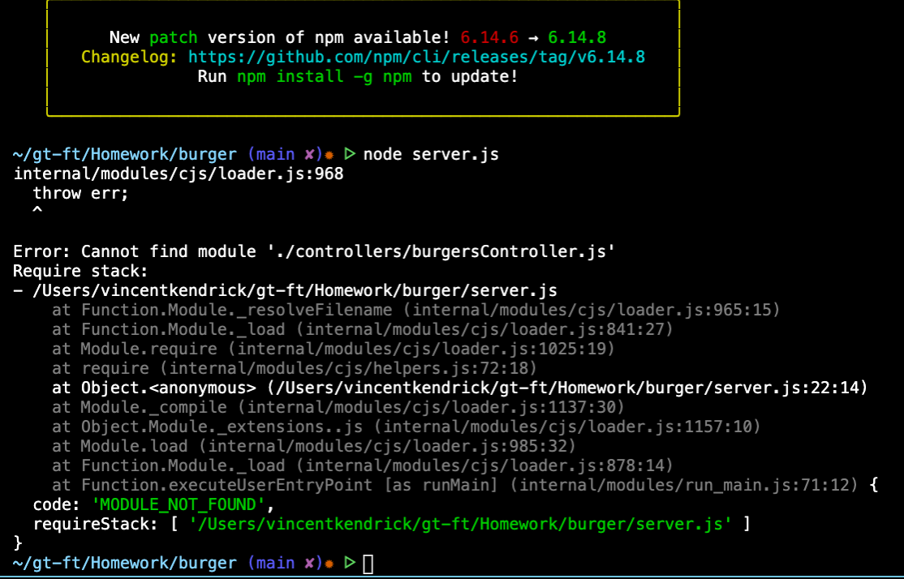
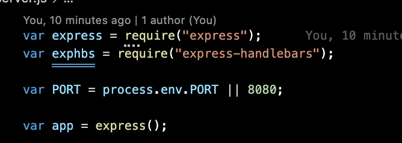
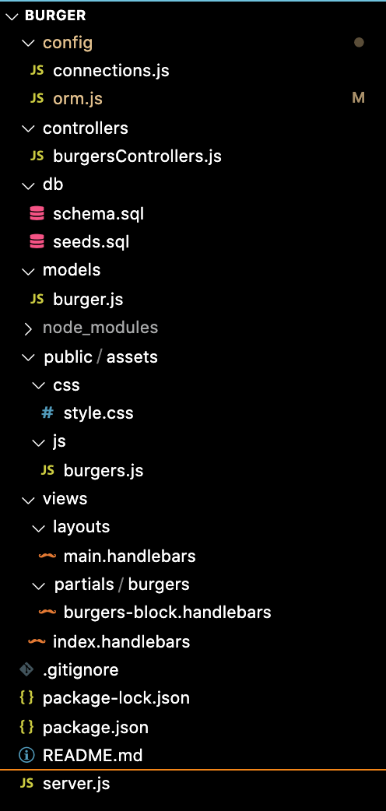
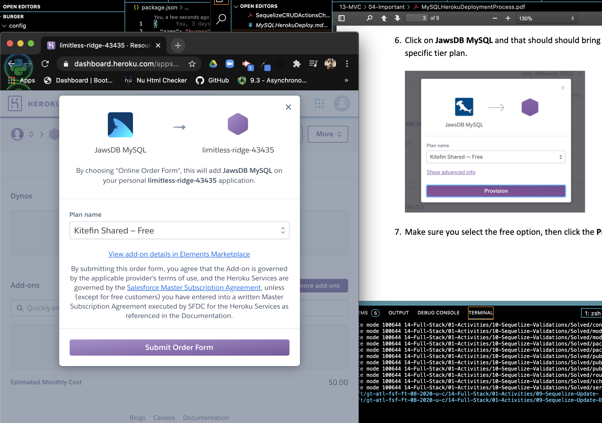
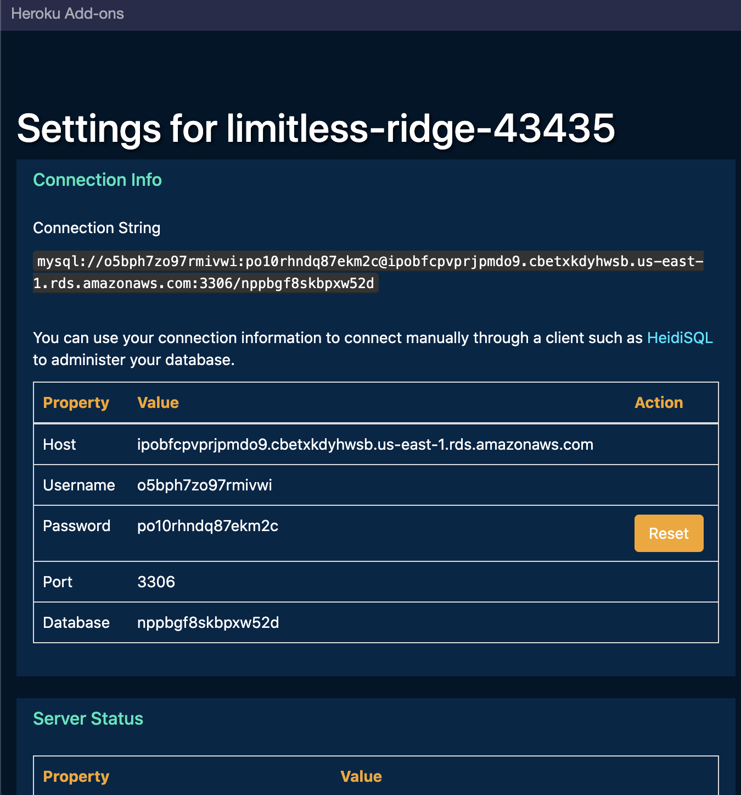

# burger
I had the most fun with this project.

# Its Was all fun until you get an err.

## this err really got to me the whole time.. i was looking...
.
# THIS IS WHERE it could not find express.
.
### My code looks better this way
.

# Heroku was easy
.
# And i was able to get this...
.

# BUT
I could not deploy... Maybe its because my app didn't work in the first place but I like this new way of working and the set up is better to read... I will keep learning.. I love this.. Too bad i suck at it...